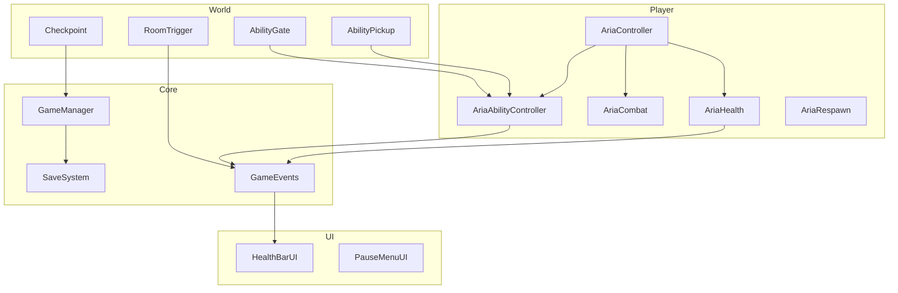

# Arquitectura — Judgment of the Fallen Wing

## Visión general

El juego sigue una arquitectura modular orientada a sistemas, típica de Metroidvanias profesionales:

## Principios de diseño

1. **Eventos sobre acoplamiento directo** — La UI y sistemas secundarios escuchan `GameEvents` en lugar de referenciar al jugador.
2. **ISaveable** — Componentes que participan en el guardado implementan `CaptureState` / `RestoreState`.
3. **Ability gating** — Toda mecánica avanzada pasa por `AriaAbilityController.HasAbility()`.
4. **Datos en ScriptableObjects** — Stats de ARIA en `AriaStatsSO` para iterar balance sin tocar código.

## Flujo de una partida

1. `GameManager` carga `SaveData` al iniciar.
2. ARIA spawnea en el último checkpoint (`SaveData.lastCheckpointId`).
3. Al entrar en salas, `RoomTrigger` registra visita y ajusta cámara.
4. Pickups desbloquean habilidades → se guardan automáticamente.
5. Muerte → `AriaRespawn` devuelve a spawn/checkpoint tras delay.
6. Escape → pausa; desde menú se puede guardar manualmente.

## Convenciones de código

- Namespace raíz: `JudgmentOfTheFallenWing`
- Prefijo de logs de ARIA: `[ARIA]`
- IDs únicos string para gates, checkpoints y pickups (ej: `zone1_dash_pickup`)
- Tags: `Player`, `Enemy`
- Layers: `Ground`, `Player`

## Integración con tu proyecto existente

Si ya tienes scripts propios:

| Conflicto potencial | Resolución |
|---------------------|------------|
| PlayerController existente | Renombrar o fusionar con `AriaController` |
| Save system propio | Migrar datos a `SaveData` |
| Input System nuevo | Adaptar `ReadInput()` en `AriaController` |

Comparte tu rama o sube el proyecto completo para una integración directa.
